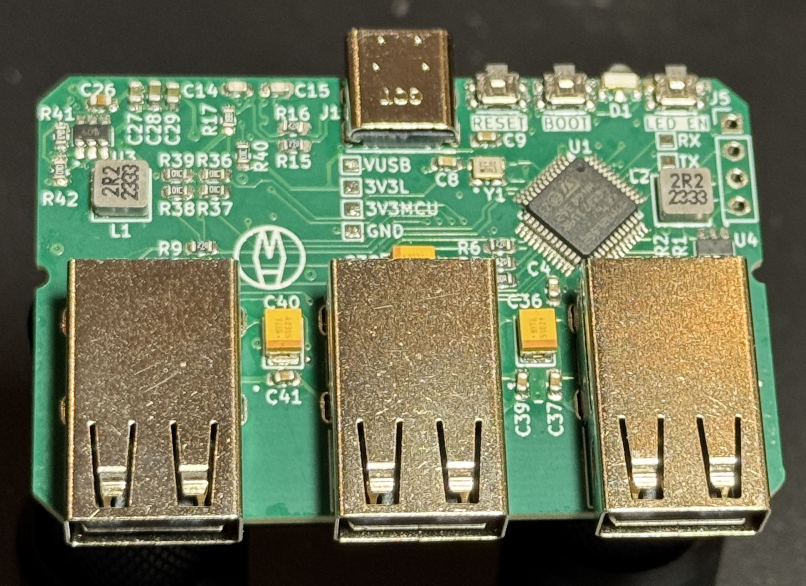
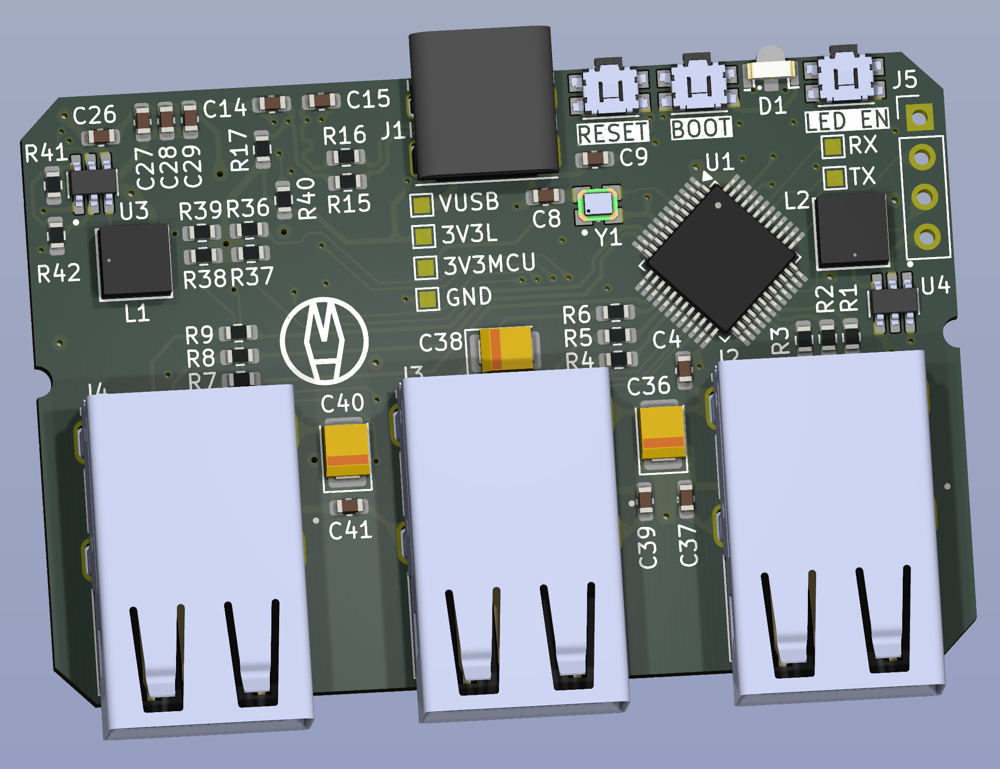
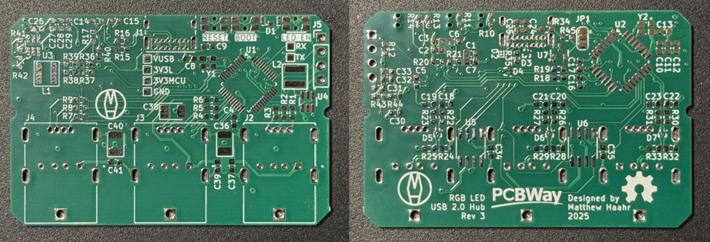
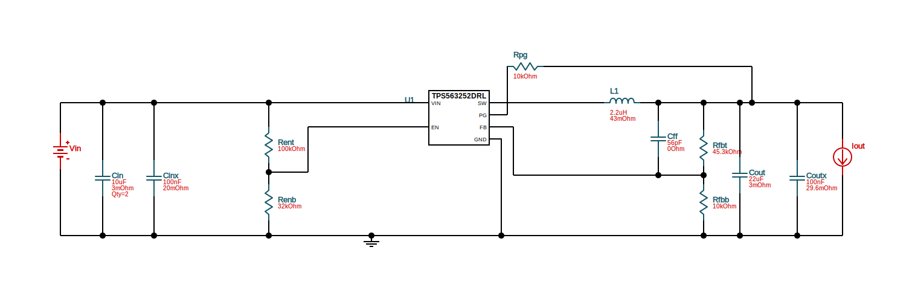
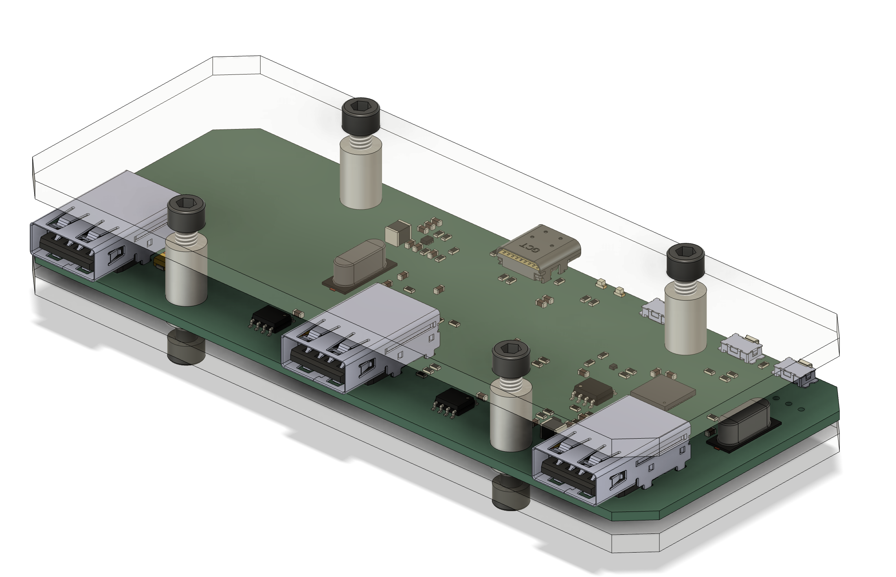

# 3-Port USB Hub with Integrated Microcontroller and RGB USB-A Ports

<!--  -->

 
## Features
- USB C Port for Upstream
- 3 USB 2.0 Downstream Ports
    - USB A, Full Speed
    - Using RGB LED USB Ports (the reason behind this whole project)
- STM32L552 to Control the LEDs
    - Intended to be flashed using DFU, but SWD with Reset is available
- USB Hub Controller:
    - Using a TI 4 Port USB Controller
- Status LEDs for Power and USB Connection

## PCBWay
Version 3 of the RGB LED USB Hub was kindly supported by PCBWay who graciously provided the PCBs for this project.

PCBWay offers very affordable and high quality PCB manufacturing and assembly as well as CNC machining and 3D printing for hobbyists, low volume prototyping, and even commercial use. The provide fast turnaround times, an easy to use service, and highly accurate and detailed boards all at a low cost. 

## Table Of Contents
- [Features](#features)
- [PCBWay](#pcbway)
- [Bill Of Materials](#bill-of-materials)
- [Part Selection](#part-selection)
- [Case Design](#case-design)
- [Code](#code)
- [Extra Notes](#extra-notes)

## Bill of Materials
<!--  [Digi-Key Cart with all components]() -->
<!--  TODO: Create new DigiKey Cart -->
<!--  
    - NAME - FUNC
        - Component: REF
        - Quantity: 
        - [Datasheet]()
        - [DigiKey]()
-->
- ICs
    - STMicroelectronics STM32L552CET6 - Microcontroller w/ USB and Multiple PWM Timers
        - Component: U1
        - Quantity: 1
        - [Datasheet](https://www.st.com/resource/en/datasheet/stm32l552cc.pdf)
        - [DigiKey](https://www.DigiKey.com/en/products/detail/stmicroelectronics/STM32L552CET6/11591114)
    - TI TUSB2046 - 4 Port USB 2.0 Hub/Controller
        - Component: U2
        - Quantity: 1
        - [Datasheet](https://www.ti.com/lit/ds/symlink/tusb2046i.pdf)
        - [DigiKey](https://www.DigiKey.com/en/products/detail/texas-instruments/TUSB2046IBVF/7400166)
    - TI TLV62569 - High Efficiency Buck Converter (3V3 Regulator)
        - Component: U3, U4
        - Quantity: 2
        - [Datasheet](https://www.ti.com/lit/ds/symlink/tlv62569.pdf)
        - [DigiKey](https://www.DigiKey.com/en/products/detail/texas-instruments/TLV62569PDDCR/8106072)
    - TI TPS2042BDR - USB Power Switch (500 mA)
        - Component: U5, U6
        - Quantity: 2
        - [Datasheet](https://www.ti.com/lit/ds/symlink/tps2042b.pdf)
        - [DigiKey](https://www.digikey.com/en/products/detail/texas-instruments/TPS2042BDR/656532)
    - Analog Devices/Maxim Integrated MAX809 - 3V Power Supervisor
        - Component: U7
        - Quantity: 1
        - [Datasheet](https://www.analog.com/media/en/technical-documentation/data-sheets/max803-max810z.pdf)
        - [DigiKey](https://www.DigiKey.com/en/products/detail/analog-devices-inc-maxim-integrated/MAX809TEUR-T/1173228)
- Diodes
    - Broadcom HSMF-C143 - Dual Color (Amber: Power/Green: USB) Status LED
        - Component: D1
        - Quantity: 1
        - [Datasheet](https://mm.digikey.com/Volume0/opasdata/d220001/medias/docus/2369/HSMF-C143.pdf)
        - [DigiKey](https://www.digikey.com/en/products/detail/HSMF-C143/5800153)    
    - TI ESD441- 1-Channel VUSB ESD Diode
        - Component: D2
        - Quantity: 1
        - [Datasheet](https://www.ti.com/lit/ds/symlink/esd441.pdf)
        - [DigiKey](https://www.DigiKey.com/en/products/detail/texas-instruments/ESD441DPLR/21298753)    
    - TI TPD2EUSB30 - 2-Channel USB ESD/TVS Diode
        - Component: D3, D4, D5, D6, D7
        - Quantity: 5
        - [Datasheet](https://www.ti.com/lit/ds/symlink/tpd2eusb30.pdf)
        - [DigiKey](https://www.DigiKey.com/en/products/detail/texas-instruments/TPD2EUSB30DRTR/2193486)
- Connectors
    - GCT USB4085-GF-A - USB 2.0 Type C Port
        - Component: J1
        - Quantity: 1
        - [Datasheet](https://gct.co/files/drawings/usb4085.pdf)
        - [DigiKey](http://DigiKey.com/en/products/detail/gct/USB4085-GF-A/9859662)
    - Tensility 54-00266 - RGB USB 2.0 Type A Port
        - Component: J2, J3, J4
        - Quantity: 3
        - [Datasheet](https://tensility.s3.us-west-2.amazonaws.com/uploads/pdffiles/54-00266.pdf)
        - [DigiKey](http://DigiKey.com/en/products/detail/tensility-international-corp/54-00266/17085369)
- Switches
    - Panasonic EVQ-P7L01P - Tactile Push Button
        - Component: SW1, SW2, SW3
        - Quantity: 3
        - [Datasheet](https://4donline.ihs.com/images/VipMasterIC/IC/PANA/PANAS45028/PANAS45028-1.pdf?hkey=52A5661711E402568146F3353EA87419)
        - [DigiKey](https://www.DigiKey.com/en/products/detail/panasonic-electronic-components/EVQ-P7L01P/4429453)
- Oscillators 
    - ECS ECS-2033-080-BN - STM32 8 MHz HSE
        - Component: Y1
        - Quantity: 1
        - [Datasheet](https://ecsxtal.com/store/pdf/ecs-2025-2033.pdf)
        - [DigiKey](https://www.digikey.com/en/products/detail/ecs-inc/ECS-2033-080-BN/1693364)
    - ECS ECS-2033-060-BN - USB Controller 6 MHz
        - Component: Y2
        - Quantity: 1
        - [Datasheet](https://ecsxtal.com/store/pdf/ecs-2025-2033.pdf)
        - [DigiKey](https://www.digikey.com/en/products/detail/ecs-inc/ECS-2033-060-BN/1693362)
- Capacitors
    - *All Components are 0603 MLCC Capacitors unless otherwise noted*
    - 100nF
        - Component: C1, C2, C3, C4, C5, C9, C11, C12, C34, C35, C37, C39, C41
        - Quantity: 13
        - [DigiKey](https://www.digikey.com/en/products/detail/yageo/CC0603KRX7R7BB104/302822)
    - 10µF
        - Component: C6, C25, C27, C28, C29, C31, C32, C33
        - Quantity: 8
        - [DigiKey](https://www.digikey.com/en/products/detail/yageo/CC0603MRX5R6BB106/5195224)
    - 1µF
        - Component: C7, C10, C24
        - Quantity: 3
        - [DigiKey](https://www.digikey.com/en/products/detail/yageo/CC0603KRX5R8BB105/2833610)
    - 10nF
        - Component: C8, C13
        - Quantity: 2
        - [DigiKey](https://www.digikey.com/en/products/detail/yageo/CC0603KRX7R8BB103/2103098)
    - 22pF
        - Component: C14, C15, C16, C17, C18, C19, C20, C21, C22, C23
        - Quantity: 10
        - [DigiKey](https://www.digikey.com/en/products/detail/yageo/CC0603JRNPO8BN220/5883592)
    - 4.7µF
        - Component: C26, C30
        - Quantity: 2
        - [DigiKey](https://www.digikey.com/en/products/detail/yageo/CC0603KRX5R7BB475/5195193)
    - 100µF - Tantalum
        - Component: C36, C38, C40
        - Quantity: 3
        - [DigiKey](https://www.digikey.com/en/products/detail/kyocera-avx/TAJB107K010RNJ/9748493)
- Resistors:
    - *All Components are 0603 Thick Film Resistors unless otherwise noted*
    - 200Ω
        - Component: R1, R4, R7
        - Quantity: 3
        - [DigiKey](https://www.digikey.com/en/products/detail/yageo/RC0603FR-13200RL/13694128)
    - 62Ω
        - Component: R2, R5, R8
        - Quantity: 3
        - [DigiKey](https://www.digikey.com/en/products/detail/yageo/RC0603FR-0762RL/727335)
    - 27Ω
        - Component: R3, R6, R9, R15, R16, R18, R19, R22, R23, R26, R27, R30, R31
        - Quantity: 13
        - [DigiKey](https://www.digikey.com/en/products/detail/yageo/RT0603BRD0727RL/1072412)
    - 10kΩ
        - Component: R10, R11, R12, R46, R47, R48, R40, R45
        - Quantity: 9
        - [DigiKey](https://www.digikey.com/en/products/detail/yageo/RC0603FR-0710KL/726880)
    - 1.74kΩ
        - Component: R13
        - Quantity: 1
        - [DigiKey](https://www.digikey.com/en/products/detail/yageo/RC0603FR-071K74L/726872)
    - 665Ω
        - Component: R14
        - Quantity: 1
        - [DigiKey](https://www.digikey.com/en/products/detail/yageo/RC0603FR-07665RL/727349)
    - 1.5kΩ
        - Component: R17
        - Quantity: 1
        - [DigiKey](https://www.digikey.com/en/products/detail/yageo/RC0603FR-071K5L/726864)
    - 15kΩ
        - Component: R20, R21, R24, R25, R28, R29, R32, R33
        - Quantity: 8
        - [DigiKey](https://www.digikey.com/en/products/detail/yageo/RC0603FR-0715KL/726953)
    - 5.1kΩ
        - Component: R34, R35
        - Quantity: 2
        - [DigiKey](https://www.digikey.com/en/products/detail/yageo/RC0603FR-075K1L/727268)
    - 453kΩ
        - Component: R41, R43
        - Quantity: 2
        - [DigiKey](https://www.digikey.com/en/products/detail/yageo/RC0603FR-07453KL/727247)
    - 100kΩ
        - Component: R42, R44
        - Quantity: 2
        - [DigiKey](https://www.digikey.com/en/products/detail/yageo/RC0603FR-07100KL/726889)
- Inductor
    - Bourns SRP4020FA-2R2M - 2.2µH Inductor
        - Component: L1, L2
        - Quantity: 2
        - [Datasheet](https://www.bourns.com/docs/Product-Datasheets/SRP4020FA.pdf)
        - [DigiKey](https://www.DigiKey.com/en/products/detail/bourns-inc/SRP4020FA-2R2M/9351010)
        
## Part Selection
- Power Supply selected using TI Webench Power Designer:
    - DC-DC: 5V In, 3.3V @ 1A (min) Out
    - High-Efficiency
    
    - [Webench Page](https://webench.ti.com/appinfo/webench/scripts/SDP.cgi?ID=0260EB68D9ACEA79)
- LED Resistors:
    - Indicators:
        - Target Intensity of 2.5mcd
        - Amber:
            - Average 66mcd @ 20mA
            - Forward Voltage of 2V
            - Target Current: ~0.75mA
            - Resistance: 1.74kΩ
        - Green:
            - Average 25.5mcd @ 20mA
            - Forward Voltage of 2V
            - Target Current: ~1.96mA
            - Resistance: 665Ω
    - USB:
        - Target Intensity of 200mcd
        - Red:
            - Average 600mcd @ 20mA
            - Forward Voltage of 1.3V
            - Target Current: ~6.5mA
            - Resistance: 200Ω
        - Green:
            - Average 800mcd @ 20mA
            - Forward Voltage of 0.3V
            - Target Current: ~5mA
            - Resistance: 62Ω
        - Blue:
            - Average 350mcd @ 20mA
            - Forward Voltage of 0.3V
            - Target Current: ~11.5mA
            - Resistance: 27Ω
    
## Case Design
<!--  TODO: Case design needs to be updated  -->
<!--    -->
- 3D Printed Top and Bottom Covers

## Code
<!--  TODO: All code needs to be updated  -->
<!--
- The fork of CircuitPython for this device is located [here](https://github.com/mjhaahr/USB_Hub_CircuitPython)
    - If you would like just the firmware, that is [here](code/CircuitPython/firmware.uf2)
- `LED_EN` button cycles between the following states
    - All LEDs on
    - All LEDs on with dimmer Port LEDs
    - Just Port LEDs
    - Just Port LEDs but dimmer
    - Just Status LEDs
    - All Off
- To prevent the device from showing up as a removable storage device when connected, that's disabled on boot
    - To re-enable, hold the `LED_EN` button during boot, the `PWR_LED` should flash and the microcontroller will mount as removable storage (for things like firmware updates)
-->
- To view all the code, see it [here](code)

## Extra Notes
- Version 1:
    - V1 used an Adafruit KB2040 Dev Board instead of a standalone implementation
    - V1 used the SL2.1a USB Hub and was a poor attempt to get USB working
- Version 2:
    - Proper standalone RP2040 implementation
    - Switch to TUSB2046 4-Port USB Controller
    - Switch to 4 Layer Board with correct implementation of USB Hardware Guidelines

- Version 3:
    - Switch to STM32 (STM32L552)
    - Shrink board
    - Switch to Oscillators from Crystals
    - 3V3 Regulators using a larger package
    - Fully Enclosed 3D Printed Case
