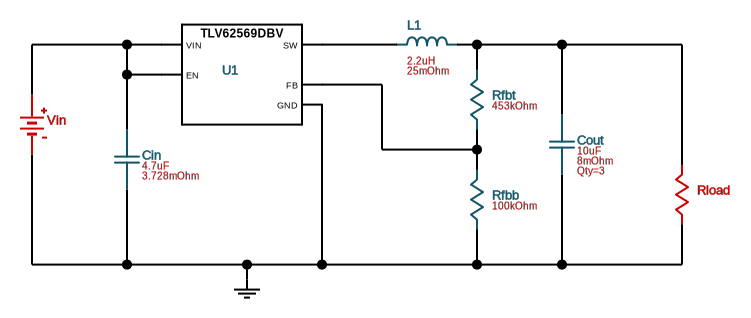

# 3-Port USB Hub with Integrated Microcontroller and RGB USB-A ports

**TODO: Embed image of PCB Design**

Features:
- 3x RGB LED USB (USB A, Full Speed) ports
- 1x USB C Port (downstream)
- 1x RP 2040 to control the LEDs
  - V1 used an Adafruit KB2040
  - V2 will switch to a standalone RP2040 implementation
- USB Hub Controller:
  - V1 uses the SL2.1a USB Hub
  - V2 will switch to a more full-featured USB Hub Controller and more closely comply with the USB Spec
- Possibly exposed connectors for more features externally or internally (i.e. leaving a cutout in the board with room for expansion)

## Full Bill of Materials
**[Digi-Key Cart with all components](https://www.digikey.com/short/4rfrj37h)**
- 1x Raspberry Pi RP2040: [Datasheet](https://datasheets.raspberrypi.com/rp2040/rp2040-datasheet.pdf), [HW Design Guide](https://datasheets.raspberrypi.com/rp2040/hardware-design-with-rp2040.pdf)
- 1x Winbond W25Q16JVSNIQ QSPI Flash: [Datasheet](https://docs.rs-online.com/19e0/0900766b81622f8b.pdf)
- 1x TI TUSB2046 USB Controller: [Datasheet](https://www.ti.com/lit/ds/symlink/tusb2046i.pdf)
- 2x TI TPS2042 USB Power Switch: [Datasheet](https://www.ti.com/lit/ds/symlink/tps2042b.pdf)
- 5x TI TPD2EUSB30 USB ESD/TVS Diodes: [Datasheet](https://www.ti.com/lit/ds/symlink/tpd2eusb30.pdf)
- 2x TI TPS56325 High-Efficiency Buck Converter: [Datasheet](https://www.ti.com/lit/ds/symlink/tps563252.pdf)
- 1x Microchip TC54VN3002 3V Supervisor Circuit [Datasheet](https://ww1.microchip.com/downloads/aemDocuments/documents/MSLD/ProductDocuments/DataSheets/20001434K.pdf)
- 3x Tensility 54-00266 RGB USB 2.0 Type A Port: [Datasheet](http://www.tensility.com/pdffiles/54-00266.pdf)
- 1x GCT USB4085 USB 2.0 Type C Port:[Datasheet](https://gct.co/files/drawings/usb4085.pdf)
- 3x C&K KSS221GLFS Push Buttons: [Datasheet](https://www.ckswitches.com/media/1463/kss.pdf)
- Crystals:
  - 1x Würth Elektronik 830016788 6MHz Crystal (USB Hub Controller): [Datasheet](https://www.we-online.com/components/products/datasheet/830016788.pdf)
  - 1x Würth Elektronik 830003210 12MHz Crystal (RP2040 External Osc): [Datasheet](https://www.we-online.com/components/products/datasheet/830003210.pdf)
- LEDs:
  - 1x LTST-S270KFKT Orange LED 2V: [Datasheet](https://optoelectronics.liteon.com/upload/download/DS22-2000-209/LTST-S270KFKT.pdf)
  - 1x LTST-S270KGKT Green LED 2V: [Datasheet](https://optoelectronics.liteon.com/upload/download/DS22-2000-226/LTST-S270KGKT.pdf)
- Capacitors:
  - *All Packages are 0603 unless otherwise noted*
  - 12x 22pF Ceramic
  - 2x 50pF Ceramic
  - 2x 56pF Ceramic
  - 25x 0.1µF Ceramic
  - 4x 1µF Ceramic
  - 5x 10µF Ceramic
  - 2x 22µF Ceramic
  - 3x 100µF Tantalum - *EIA-3528-21-AVX Package*
- Resistors:
  - *All Packages are 0603 unless otherwise noted*
  - 6x 14Ω
  - 12x 27Ω
  - 5x 80Ω
  - 1x 530Ω
  - 1x 604Ω
  - 1x 1kΩ
  - 1x 1.5kΩ
  - 2x 5.1kΩ
  - 11x 10kΩ
  - 8x 15kΩ
  - 2x 32kΩ
  - 2x 45.3kΩ
  - 2x 100kΩ
- 2x 2.2uH Inductor - *1210 Package*

## Part Selection
- Power Supply selected using TI Webench Power Designer:
  - DC-DC: 5V In, 3.3V @ 0.5A (min) Out
  - High-Efficiency
  
  - [Webench Page](https://webench.ti.com/appinfo/webench/scripts/SDP.cgi?ID=E20EF4E51E15D568)
- Crystals supporting passives selected following the calculations in [this guide](https://www.st.com/resource/en/application_note/an2867-oscillator-design-guide-for-stm8afals-stm32-mcus-and-mpus-stmicroelectronics.pdf) published by ST
  - `CL = 2 * (C_Load - C_Stray)`
  - `R_Ext = 1 / (2 * π * F * CL)`

## CircuitPython Things
- `LED_EN` button cycles between ports and status, just ports, and all off
